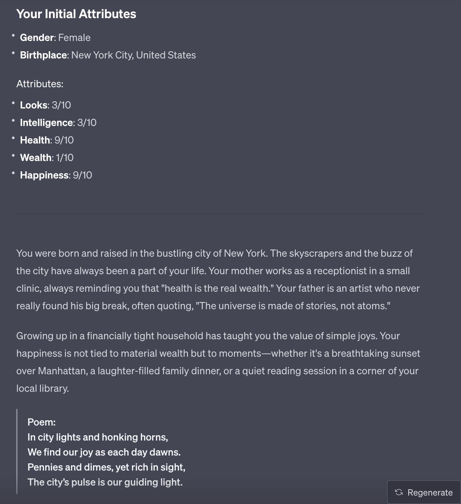
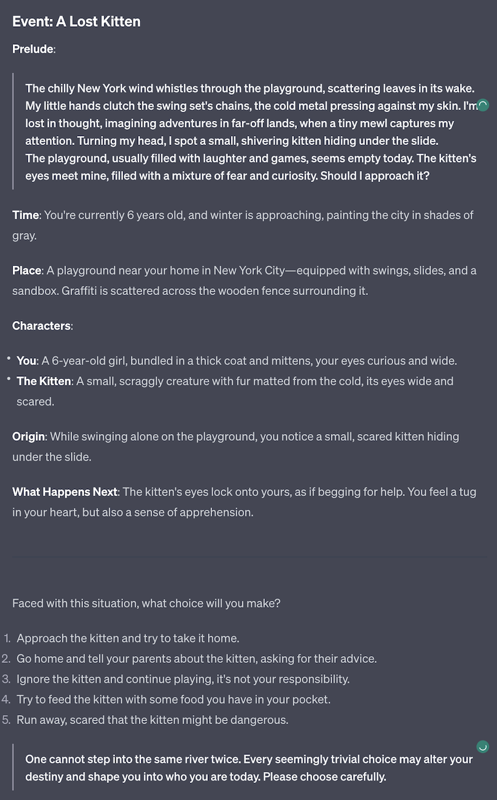
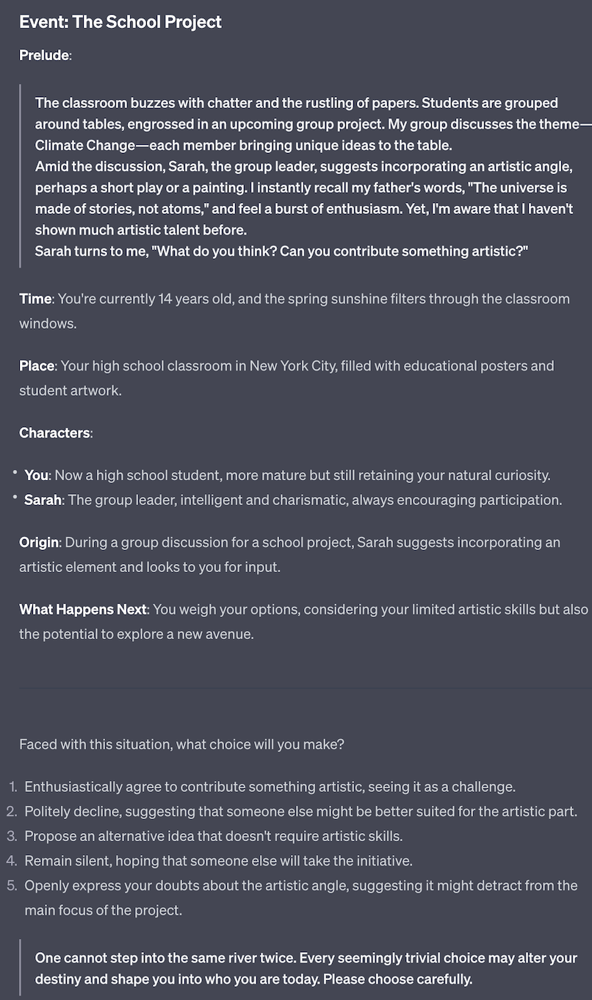
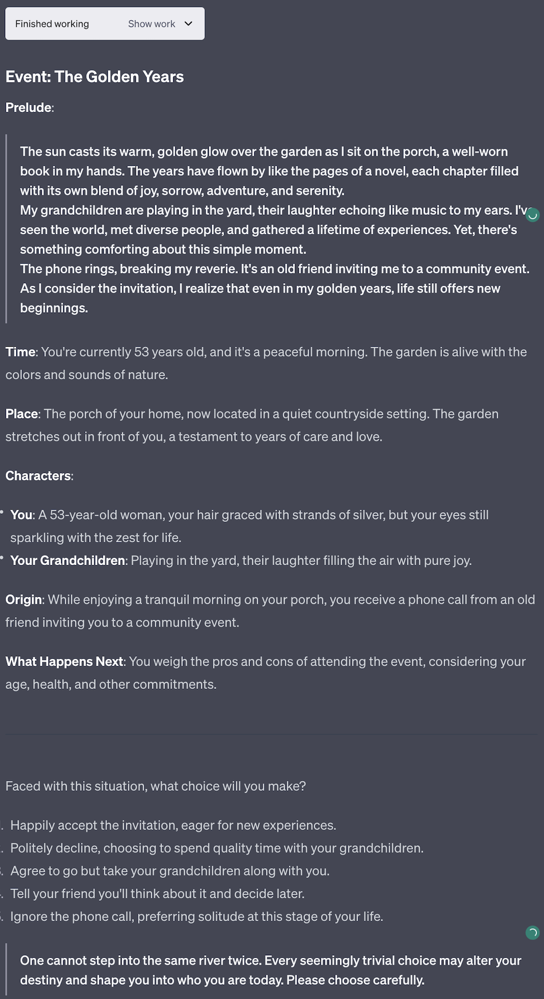

## 🐱🐹 Life Reloaded - A Life Simulation Game 🐹🐱

### 🌟 Introduction

> "Life is but a dream and everything is empty; however, in this 'emptiness' lies everything in the universe."  

> If you've ever had countless "what if" and "if only" about your life, **Life Reloaded** gives you a chance to restart and relive your life!

---

### 🌈 Overview 

This project is a life simulation game powered by GPT-4's Advanced Data Analysis (formerly Code Interpreter) feature. 

The game content is generated in real-time by state-of-the-art AI GPT-4, giving you a rich and colorful life experience.

- **Project Name**: Life Reloaded 
- **Version**: 0.1 beta
- **Core Driver**: GPT-4 Advanced Data Analysis
- **Original Author**: [陈财猫🐱](https://okjk.co/RBfY7P)
- **Translation**: [sharqwy](https://twitter.com/sharqwy)

### 🚀 Features

1. **Perfect integration of literature and AI**: Carefully crafted modern Chinese literary style immerses you into the game.

2. **Character building based on developmental psychology**: The characters in the game are not simple NPCs, but have backgrounds, stances, and emotions - they are "people".

3. **Diverse life paths**: From academics to career, from love to family, every choice impacts your life journey. 

4. **Randomness and playability**: GPT-4's advanced data analysis generates abundant life events and attributes on the fly. Each gameplay is a brand new experience.

### 📥 Installation and Setup

To run the game, open GPT-4's [Advanced Data Analysis (formerly Code Interpreter)](https://chat.openai.com/?model=gpt-4-code-interpreter) and copy-paste the full content of [LifeReloaded.txt](https://github.com/sharkqwy/LifeReloaded/blob/main/LifeReloaded.txt) into the chatbox. 

#### Prerequisites

⚠️ **You must enable GPT-4's Advanced Data Analysis (formerly Code Interpreter). Currently, it's only available to ChatGPT Plus users.**

#### Get Updates

🔗 This project gets updated periodically. Please visit the [GitHub repo](https://github.com/sharkqwy/LifeReloaded).

### 🎮 Game Preview

Here are some screenshots of the game. Your experience may vary due to the randomness of large language models. 

#### Initialization 

At the beginning of each game, the system randomly generates and assigns the player's gender, birthplace, initial stats, family background, etc.

Each character also gets a unique poem.

#### Events

The player encounters different events at different life stages and can react to them.

All events and options are generated on the fly by GPT4 Code Interpreter. 

Every choice will change the character's life path or stats, so choose wisely!

### 🤝 Open Source & Collaboration 

🔗 This game is supported by the [EmbraceAGI](https://github.com/EmbraceAGI) open source community, and is a sister project to [LangGPT](http://feishu.langgpt.ai).

Please visit the [LangGPT GitHub repo](https://github.com/yzfly/LangGPT) for details.

### 📜 License

🔗 This project is licensed under [CC BY-NC-SA 4.0](https://creativecommons.org/licenses/by-nc-sa/4.0/). 

---

### Special Thanks

- [Mr. Ranedeer AI Tutor](https://github.com/JushBJJ/Mr.-Ranedeer-AI-Tutor) project - the talented prompts inspired me a lot.

- Cao Xueqin, author of Dream of the Red Chamber - inspired me to insert poems in the writing.

- "Dr. Pumpkin" Official Account - her idea of ["using Code Interpreter to build a life simulation game"](https://mp.weixin.qq.com/s/gV6xvVVqG8djdmB6EAuZKw) directly gave birth to this project. Her [high quality articles](https://mp.weixin.qq.com/mp/appmsgalbum?action=getalbum&__biz=MzA4MjM5MDI0Ng==&scene=1&album_id=3104850832623386631&count=3#wechat_redirect) also inspired me.

- [Liu Hai](https://nanfangshaonian.feishu.cn/wiki/WkKAwJ90uidtzVkM9IecSZB5nbg)'s article on [pseudo code prompts](https://nanfangshaonian.feishu.cn/wiki/YhNdws9LCi1JxGkpJ8dcXB3Gnih) gave me some inspiration for this prompt.

---

🎮 **Don't wait any longer - come experience your second life now!** 

---
